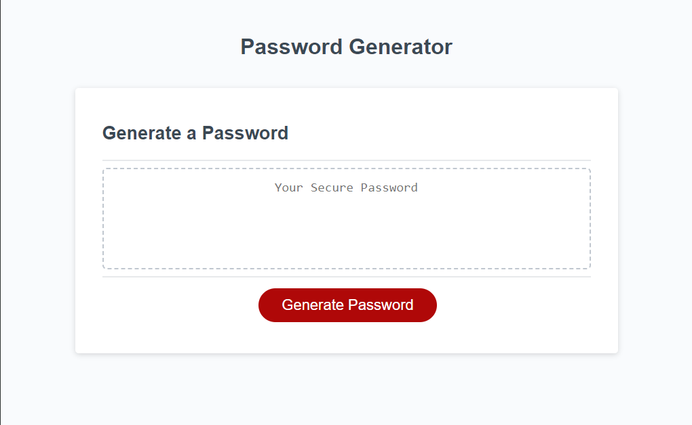
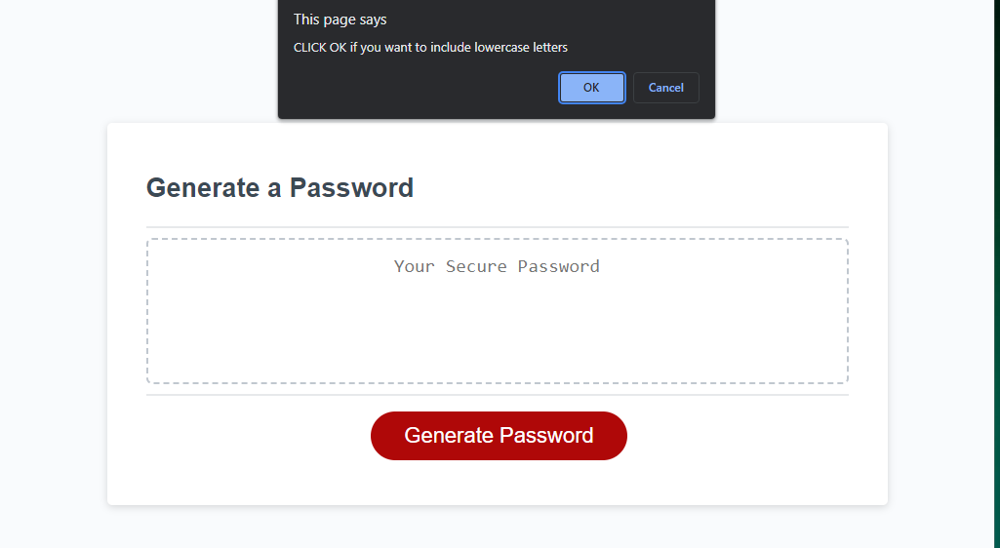
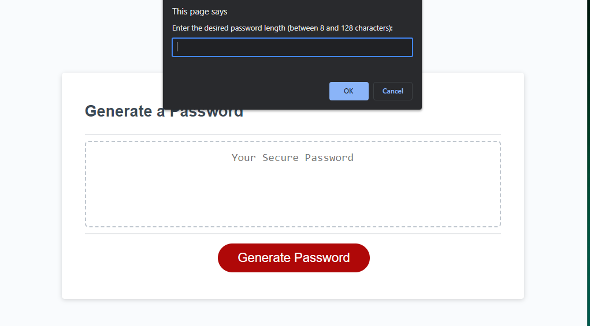

# Password_generator

<!-- link to deployed here  -->

## ***Description***

*Password is randomly generated based on criteria the user selects when prompted.
when the user clicks *"Generate password"* button series of prompts pop up for password criteria user input is validated
at least one character type must be selected, after confirming which characters to include, 
when prompted for the length of the password the user needs to have 8 characters and no more than 128 characters
when all prompts are answered, the password is generated and displayedd*

## ***Usage***

## ***License***

**This is under the MIT License**